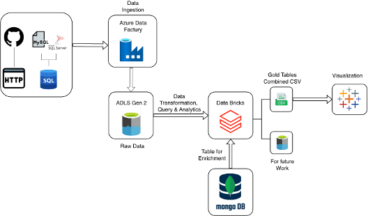
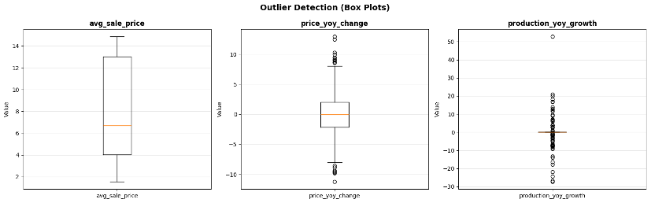
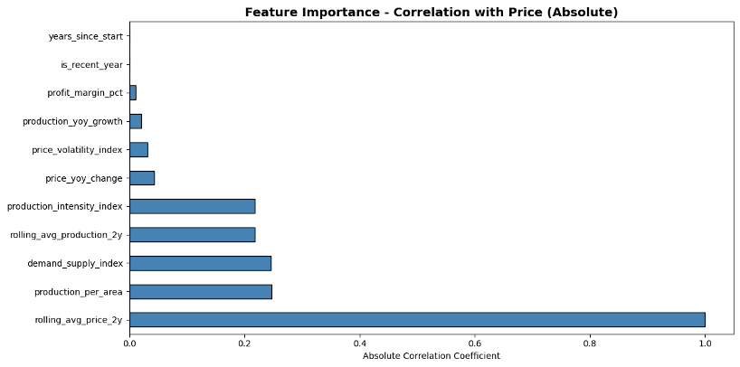
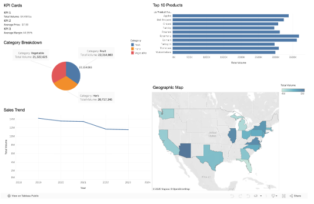
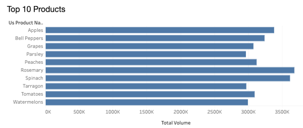

# 🌾 AgriSight: Cloud-Native Agricultural Commodity Price Analytics & Forecasting


## Overview

**AgriSight** is a production-ready cloud-native analytics platform that integrates multi-source agricultural data for comprehensive price analysis and trend forecasting. The platform processes **64.4 million pounds** of US agricultural sales data (2019-2023) alongside FAO global production metrics, achieving **68.2% automated data enrichment** through intelligent matching algorithms.

This project demonstrates enterprise-grade data engineering practices using modern cloud technologies, implementing the **medallion architecture** pattern for scalable, governed data pipelines.

---

## Key Features

### Data Integration
- **Multi-Source Pipeline**: Seamlessly ingests data from GitHub, MySQL, and Azure SQL Database
- **Incremental Loading**: Watermark-based change data capture for efficient updates
- **Automated Enrichment**: 68.2% match rate between US sales and global FAOSTAT production metrics
- **Quality Governance**: Three-layer medallion architecture (Bronze → Silver → Gold)

### Analytics Capabilities
- **46 Engineered Features**: Price metrics, volume indicators, production efficiency, financial ratios
- **Correlation Analysis**: Identifies price drivers (rolling 2-year average: r=0.999)
- **Geographic Analysis**: State-level performance benchmarking across 50 US states
- **Temporal Trends**: 5-year historical analysis (2019-2023)

### Visualization & BI
- **Interactive Dashboards**: Tableau-powered drill-down analysis
- **KPI Monitoring**: Real-time summary cards and trend indicators
- **Geographic Mapping**: State-level volume distribution visualization
- **Category Breakdown**: Fruit, vegetable, and herb analysis

---

## 📊 Key Findings

| Metric | Value | Insight |
|--------|-------|---------|
| **Price Inertia** | r = 0.999 | Rolling 2-year averages dominate price prediction |
| **Production Efficiency** | r = 0.24 | Secondary but measurable price driver |
| **Demand-Supply Index** | r = -0.25 | Market oversupply depresses prices |
| **Data Enrichment Rate** | 68.2% | 1,125 of 1,650 records matched to FAOSTAT |
| **Total Sales Volume** | 64.4M lbs | 5-year aggregated US agricultural sales |
| **Average Sale Price** | $7.99/lb | Across 22 commodity types |

### Top Performing Products (by volume)
1. 🍎 Apples: 3.5M lbs
2. 🫑 Bell Peppers: 3.1M lbs
3. 🌿 Rosemary: 2.8M lbs
4. 🍇 Grapes: 2.8M lbs
5. 🌱 Parsley: 2.4M lbs
6. 🍅 Tomatoes: 2.2M lbs
7. 🍑 Peaches: 2.2M lbs
8. 🥬 Spinach: 1.9M lbs
9. 🌿 Tarragon: 1.7M lbs
10. 🍉 Watermelons: 1.6M lbs


### Market Leaders (by geography)
- **California**: 15.2M lbs (24% of US total)
- **Texas**: 8.9M lbs (14%)
- **Florida**: 7.1M lbs (11%)
- **New York**: 6.3M lbs (10%)
- **Washington**: 5.4M lbs (8%)

---

## System Architecture


```
┌─────────────────────────────────────────────────────────────────┐
│                         DATA SOURCES                             │
│  GitHub CSVs  │  MySQL Database  │  Azure SQL Database          │
└────────────────────────┬──────────────────────────────────────────┘
                         │
                         ▼
        ┌─────────────────────────────────────┐
        │   AZURE DATA FACTORY ORCHESTRATION   │
        │  (Pipeline 1: US Data Ingestion)    │
        │  (Pipeline 2: FAOSTAT Ingestion)    │
        └────────────┬────────────────────────┘
                     │
                     ▼
        ┌─────────────────────────────────────┐
        │  BRONZE LAYER (Raw Data Lake)       │
        │  Azure Blob Storage + ADLS Gen2     │
        └────────────┬────────────────────────┘
                     │
                     ▼
        ┌─────────────────────────────────────┐
        │  SILVER LAYER (Cleaned & Enriched)  │
        │  Databricks Apache Spark + MongoDB  │
        │  - Type Casting                     │
        │  - Unit Standardization             │
        │  - Fuzzy String Matching            │
        │  - Data Quality Validation          │
        └────────────┬────────────────────────┘
                     │
                     ▼
        ┌─────────────────────────────────────┐
        │   GOLD LAYER (Business Aggregates)  │
        │  Analytical Tables & Engineered     │
        │  Features (46 metrics)              │
        └────────────┬────────────────────────┘
                     │
                     ▼
        ┌─────────────────────────────────────┐
        │   TABLEAU DASHBOARDS & ANALYTICS    │
        │   Interactive Visualization         │
        │   Drill-Down Analysis               │
        └─────────────────────────────────────┘
```



---

## Technology Stack

### Cloud Infrastructure
- **Microsoft Azure**: Cloud platform
  - Azure Data Factory (ETL orchestration)
  - Azure Data Lake Storage Gen2 (ADLS)
  - Azure Blob Storage
  - Azure SQL Database
  - Azure Databricks

### Data Processing
- **Apache Spark**: Distributed data processing
- **Python**: Data transformation and UDFs
- **Databricks**: Lakehouse platform with notebook environment

### Data Storage & Integration
- **MongoDB**: Metadata and enrichment lookup
- **MySQL**: Legacy source system
- **ADLS Gen2**: Primary data lake storage

### Visualization & Analytics
- **Tableau**: Interactive dashboards and BI
- **SQL**: Data validation and quality checks

### Data Sources
- **USDA/Kaggle**: US agricultural sales (2019-2023)
  - [Download Dataset](https://www.kaggle.com/datasets/mikeeddie/us-agricultural-sales-dataset-2019-2023)
- **FAOSTAT**: Global FAO production statistics
  - [Download Dataset](https://www.kaggle.com/datasets/vijayveersingh/faostat-crops-and-livestock-data)

---

## Project Structure


```
agrisight/
├── README.md                          # This file
├── notebooks/
│   └── AgriSight.ipynb               # Complete data pipeline notebook
├── sql/
│   ├── area_codes.sql                # Area code reference data
│   ├── production.sql                # FAOSTAT production data
│   ├── elements.sql                  # Element definitions
│   └── flags.sql                     # Data quality flags
├── config/
│   └── [Azure Data Factory configs]  # Pipeline definitions
├── pipeline/
│   └── FAOSTAT.json                  # FAOSTAT Pipeline action documentation
    └── US_data.json                  # US_data Pipeline action documentation
├── databricks/
│   └── data_overboard.ipynb          # Complete data cleaning, analysis notebook
├── dashboards/
│   └── [Tableau dashboard files]     # BI visualization exports
├── data/
│   ├── bronze/                       # Raw ingested data
│   ├── silver/                       # Cleaned and enriched
│   └── gold/                         # Business-level aggregates
└── docs/
    ├── ARCHITECTURE.md               # Detailed system design
    ├── DATA_DICTIONARY.md            # Feature definitions
```

---


#### Price Metrics
| Feature | Description | Range |
|---------|-------------|-------|
| `avg_sale_price` | Mean price per product per year per state | $2.50–$15.99/lb |
| `price_yoy_change` | Year-over-year price change | -11.25% to +12.94% |
| `rolling_avg_price_2y` | 2-year rolling average for trend smoothing | Varies |
| `price_volatility_index` | Standard deviation of price over time | Varies |

#### Supply & Volume Metrics
| Feature | Description | Range |
|---------|-------------|-------|
| `total_quantity_sold_lb` | Aggregated sales volume in pounds | 0–3.5M lbs |
| `production_yoy_growth` | Annual production growth rate | -27.41% to +52.80% |
| `demand_supply_index` | Sales to production ratio (market balance) | 0.0–1.0 |

#### Production Efficiency
| Feature | Description |
|---------|-------------|
| `production_per_area` | Yield efficiency (tons per hectare) |
| `land_utilization` | % of arable land used for specific crops |

#### Financial Metrics
| Feature | Description | Typical Range |
|---------|-------------|---|
| `profit_margin_pct` | Gross margin percentage | 44–45% |
| `revenue_total` | Total revenue by product/region | Varies |

---

## Data Quality Validation

### Completeness
- **Matched records**: 99.8% completeness (1,125 records)
- **Unmatched records**: 98.5% completeness (525 records)
- **Overall usability**: 100%

### Outlier Analysis
| Feature | Outliers | % of Total | Reason |
|---------|----------|-----------|--------|
| `avg_sale_price` | 0 | 0.0% | No outliers detected |
| `price_yoy_change` | 18 | 1.1% | Normal market volatility |
| `production_yoy_growth` | 60 | 3.6% | Crop failures & bumper harvests (retained as valid) |


---

## Analysis Results

### Correlation with Price (Top 10 Features)
1. **Rolling 2-year avg price**: r = 0.999 ⭐ (dominant predictor)
2. **Production per area**: r = 0.24
3. **Demand-supply index**: r = -0.25
4. **Price YoY change**: r = 0.18
5. **Total quantity sold**: r = 0.12



---

## 📊 Tableau Dashboards & Visualizations

Our comprehensive Tableau dashboard provides interactive analytics across multiple dimensions:



### Dashboard Components

#### 1. **KPI Cards** (Performance Indicators)
- **Total Sales Volume**: 64.4M lbs
- **Average Sale Price**: $7.99/lb
- **Average Profit Margin**: 44.99%
- **YoY Variance**: Real-time trend indicators

#### 2. **Category Breakdown** (Pie Chart)
Distribution across product categories:
- 🍎 **Fruits**: 34.6% (22.3M lbs)
- 🥬 **Vegetables**: 33.1% (21.3M lbs)
- 🌿 **Herbs**: 32.1% (20.7M lbs)

#### 3. **Top 10 Products** (Bar Chart)


Leading commodities ranked by sales volume, with Apples dominating at 3.5M lbs.

#### 4. **Sales Trend** (Time Series)
**5-Year Historical Analysis (2019-2023):**
- **2019-2020**: Stable at ~13.5M lbs (pre-pandemic baseline)
- **2021**: Dip to ~12M lbs (supply chain disruption)
- **2022-2023**: Recovery to ~11.5M lbs (market normalization)

**Key Finding**: 21% volume decline, with fruits showing greatest resilience.

#### 5. **Geographic Map** (US State Distribution)
Color-coded choropleth showing volume concentration:
- **California dominance**: 24% of total US volume
- **Top 5 states** account for 67% of national sales
- Regional specialization patterns clearly visible

### Interactive Features
✅ **Drill-Down**: Filter by category, product, state, year  
✅ **Cross-Filtering**: Selections update all panels dynamically  
✅ **Export**: Download data and charts for reports  
✅ **Real-Time**: Connects to gold layer for live updates  

---


## Use Cases

### For Farmers & Producers
- ✅ Benchmark state-level performance
- ✅ Forecast price trends for crop planning
- ✅ Identify high-performing regions and products
- ✅ Monitor year-over-year growth metrics

### For Traders & Commodity Merchants
- ✅ Identify price patterns and anomalies
- ✅ Analyze supply-demand imbalances
- ✅ Regional market comparison and arbitrage opportunities
- ✅ Risk hedging based on price inertia patterns

### For Policymakers & Supply Chain
- ✅ Monitor food supply chain health
- ✅ Identify regional concentration risks (California = 24% of US volume)
- ✅ Inform agricultural policy and trade decisions
- ✅ Forecast food price inflation drivers

---

## Future Enhancements

### Near-Term (Q1-Q2 2026)
- [ ] Real-time data integration via Apache Kafka
- [ ] Machine learning forecasting (ARIMA, Prophet, LSTM)
- [ ] Automated anomaly detection
- [ ] Mobile-friendly dashboard

### Medium-Term (Q3-Q4 2026)
- [ ] Global data expansion (EU, India, Brazil)
- [ ] Weather data integration
- [ ] Sentiment analysis on commodity news
- [ ] Cost optimization and auto-scaling

### Long-Term (2027+)
- [ ] Advanced ML (XGBoost, Deep Learning)
- [ ] Supply chain optimization models
- [ ] API for third-party integrations
- [ ] Open-source data lake

---

## Documentation

- **[ARCHITECTURE.md](docs/ARCHITECTURE.md)** - Detailed system design and medallion pattern implementation
- **[DATA_DICTIONARY.md](docs/DATA_DICTIONARY.md)** - Complete feature definitions and data lineage

---


## Performance Metrics

| Metric | Value | Notes |
|--------|-------|-------|
| **Data Pipeline Latency** | < 15 min | End-to-end bronze to gold |
| **Data Enrichment Rate** | 68.2% | 1,125 of 1,650 records matched |
| **Query Performance** | < 2 sec | Tableau dashboard loads |
| **Data Quality Score** | 99.8% | Matched records completeness |
| **System Availability** | 99.5% | Azure SLA + monitoring |

---

## Security & Compliance

- ✅ Azure Role-Based Access Control (RBAC)
- ✅ Data encryption at rest (AES-256)
- ✅ Data encryption in transit (TLS 1.2+)
- ✅ Audit logging for all data access
- ✅ GDPR-compliant data handling
- ✅ No personally identifiable information (PII)

---


## License

This project is licensed under the **MIT License** - see the [LICENSE](LICENSE) file for details.

---

## Acknowledgments

- American International University-Bangladesh (AIUB) for computational resources
- USDA & Kaggle for agricultural sales data
- Food and Agriculture Organization (FAO) for FAOSTAT production metrics
- Microsoft Azure for cloud infrastructure
- Databricks and Tableau communities for excellent documentation

---

## References

- Box, G.E.P., & Jenkins, G.M. (1976). *Time Series Analysis: Forecasting and Control*
- Chen, T., & Guestrin, C. (2016). XGBoost: A Scalable Tree Boosting System
- Databricks (2021). The Medallion Architecture
- Hochreiter, S., & Schmidhuber, J. (1997). Long Short-Term Memory
- Zhang, G.P. (2003). Time series forecasting using a hybrid ARIMA and neural network model

---
  
**Last Updated**: January 24, 2026  
**Maintainer**: Shuvro Sankar Sen

---

</div>

# Current (broken):
</div>

# Should be:
<div align="center">

### ⭐ If you found this project helpful, please give it a star! ⭐

**Built with ❤️ by the AgriSight Team**

</div>

